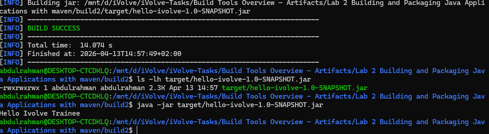
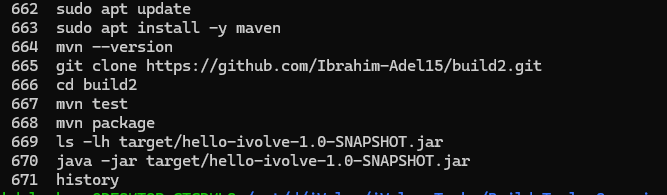

# 📦 Lab 2: Building and Packaging Java Applications with Maven

## 📖 Overview

This project demonstrates how to build, test, and run a Java application using **Maven**. The goal is to understand the full lifecycle from cloning the repository to generating the final JAR file and verifying the application.

---

## 🛠️ Prerequisites

Before starting, make sure you have the following installed:

* Java (JDK 8 or higher)
* Maven

### 🔹 Install Maven (WSL / Linux)

```bash
sudo apt update
sudo apt install maven -y
```

### 🔹 Verify Installation

```bash
mvn -version
```

---

## 📥 Clone the Repository

```bash
git clone https://github.com/Ibrahim-Adel15/build2.git
cd build2
```

---

## 🧪 Run Unit Tests

Run the following command to execute unit tests:

```bash
mvn test
```

### 📸 Test Results



---

## 🏗️ Build the Application

Build the project and generate the JAR file:

```bash
mvn package
```

### 📦 Output Artifact

The generated file will be located at:

```
target/hello-ivolve-1.0-SNAPSHOT.jar
```

### 📸 Build Output



---

## ▶️ Run the Application

Execute the generated JAR file:

```bash
java -jar target/hello-ivolve-1.0-SNAPSHOT.jar
```

---

## ✅ Verify Application

* Ensure the application runs successfully without errors.
* Check the console output for expected results.

---

## 📂 Project Structure

```
build2/
├── src/
├── target/
├── pom.xml
└── README.md
```

---

## 🎯 Key Takeaways

* Learned how to use Maven for project management
* Executed unit tests using Maven lifecycle
* Built and packaged a Java application into a JAR file
* Successfully ran and verified the application

---

## 👨‍💻 Author

**Abdulrahman Yasser**

---

## ⭐ Support

If you found this useful, feel free to star the repository ⭐
