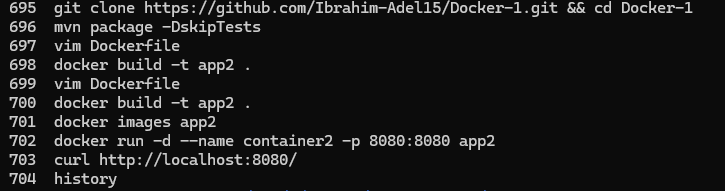
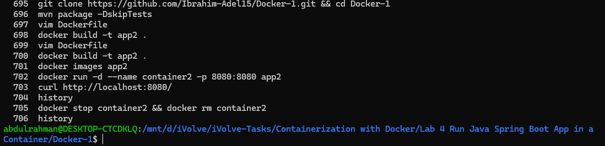
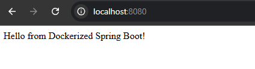

# Lab 4: Run Java Spring Boot App in a Container

## Objective

Clone a Spring Boot application, build it using Maven, containerize it using Docker (with a pre-built JAR), run the container, and verify the application is working.

---

## Prerequisites

* Ubuntu / Debian-based Linux system
* Java JDK installed
* Maven installed
* Docker installed
* Internet connection

---

## Steps

### 1. Clone the Source Code

```bash
git clone https://github.com/Ibrahim-Adel15/Docker-1.git
cd Docker-1
```

---

### 2. Build the Application

```bash
mvn package
```

Expected output:

```
[INFO] BUILD SUCCESS
```

This generates the artifact at:

```
target/demo-0.0.1-SNAPSHOT.jar
```

---

### 3. Write Dockerfile

Create a `Dockerfile` in the project root:

```Dockerfile
FROM openjdk:17

WORKDIR /app

COPY target/demo-0.0.1-SNAPSHOT.jar app.jar

EXPOSE 8080

CMD ["java", "-jar", "app.jar"]
```

---

### 4. Build Docker Image

```bash
docker build -t app2 .
```

Expected output:

```
Successfully built <image_id>
Successfully tagged app2:latest
```

> Note: This image is smaller than Lab 3 because it only contains the JAR file and Java runtime.

---

### 5. Run the Container

```bash
docker run -d -p 8080:8080 --name container2 app2
```

---

### 6. Test the Application

Open your browser and navigate to:

```
http://localhost:8080
```

Expected result:

```
Application is running successfully
```

---

### 7. Stop and Remove the Container

```bash
docker stop container2
docker rm container2
```

---

## Screenshots

### Commands Used



### Results



### Web



---

## Summary

| Step              | Command                      | Result                         |
| ----------------- | ---------------------------- | ------------------------------ |
| Clone repo        | `git clone`                  | Source code downloaded         |
| Build app         | `mvn package`                | JAR generated in target/       |
| Create Dockerfile | `Dockerfile`                 | Container instructions defined |
| Build image       | `docker build -t app2 .`     | Image created successfully     |
| Run container     | `docker run -d -p 8080:8080` | App running in container       |
| Test app          | Browser request              | Application accessible         |
| Stop container    | `docker stop && docker rm`   | Container removed              |

---

## Notes

* This approach uses a **pre-built JAR**, making the Docker image smaller and faster to build.
* The application runs on port `8080`, mapped to the host machine.
* Ensure Docker is running before executing commands.
* You can check image size using `docker images`.
