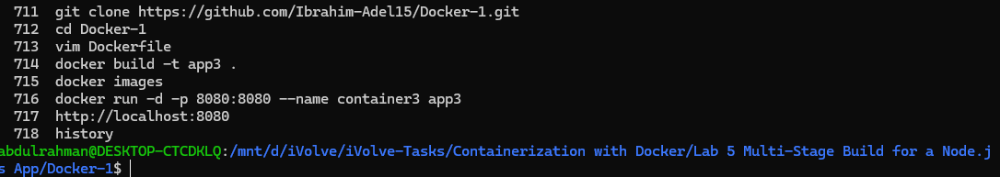
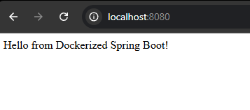

# Lab 5: Multi-Stage Build for a Java Application

## Objective

Clone a Java application, build it using a multi-stage Dockerfile, optimize the image size, run the container, and verify the application is working.

---

## Prerequisites

* Ubuntu / Debian-based Linux system
* Docker installed
* Internet connection

---

## Steps

### 1. Clone the Source Code

```bash id="2r3j7g"
git clone https://github.com/Ibrahim-Adel15/Docker-1.git
cd Docker-1
```

---

### 2. Write Multi-Stage Dockerfile

Create a `Dockerfile` in the project root:

```Dockerfile id="p9k2df"
# Stage 1: Build the application
FROM maven:3.9.6-eclipse-temurin-17 AS builder

WORKDIR /app

COPY . .

RUN mvn package

# Stage 2: Run the application
FROM openjdk:17

WORKDIR /app

COPY --from=builder /app/target/demo-0.0.1-SNAPSHOT.jar app.jar

EXPOSE 8080

CMD ["java", "-jar", "app.jar"]
```

---

### 3. Build Docker Image

```bash id="j4mfq1"
docker build -t app3 .
```

Expected output:

```id="1ewx38"
Successfully built <image_id>
Successfully tagged app3:latest
```

> Note: This image is smaller than previous builds due to multi-stage optimization.

---

### 4. Run the Container

```bash id="7f6q0n"
docker run -d -p 8080:8080 --name container3 app3
```

---

### 5. Test the Application

Open your browser and navigate to:

```id="v8m2yx"
http://localhost:8080
```

Expected result:

```id="0r9k2c"
Application is running successfully
```

---

### 6. Stop and Remove the Container

```bash id="b1z9qk"
docker stop container3
docker rm container3
```

---

## Screenshots

### Commands Used



### Web



---

## Summary

| Step              | Command                      | Result                     |
| ----------------- | ---------------------------- | -------------------------- |
| Clone repo        | `git clone`                  | Source code downloaded     |
| Create Dockerfile | Multi-stage Dockerfile       | Optimized build process    |
| Build image       | `docker build -t app3 .`     | Image created successfully |
| Run container     | `docker run -d -p 8080:8080` | App running in container   |
| Test app          | Browser request              | Application accessible     |
| Stop container    | `docker stop && docker rm`   | Container removed          |

---

## Notes

* Multi-stage builds reduce image size by separating build and runtime environments.
* Only the final JAR file is included in the production image.
* This approach is considered a best practice for Dockerized applications.
* You can compare image sizes using `docker images`.
