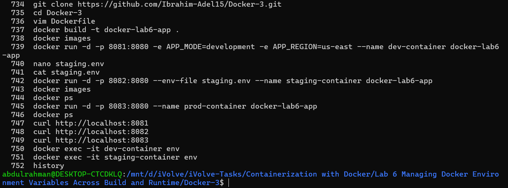
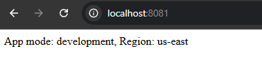
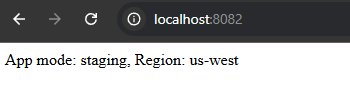
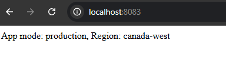

# Lab 6: Managing Docker Environment Variables Across Build and Runtime

## Objective

Learn how to manage environment variables in Docker using different methods including command-line variables, environment files, and Dockerfile defaults.

---

## Prerequisites

* Ubuntu / Debian-based Linux system  
* Docker installed  
* Internet connection  

---

## Steps

### 1. Clone the Source Code

```bash
git clone https://github.com/Ibrahim-Adel15/Docker-3.git
cd Docker-3
```

---

### 2. Create Dockerfile

```dockerfile
FROM python:3.9-slim

WORKDIR /app

COPY . /app

RUN pip install flask

EXPOSE 8080

ENV APP_MODE=production
ENV APP_REGION=canada-west

CMD ["python", "app.py"]
```

---

### 3. Build Docker Image

```bash
docker build -t docker-lab6-app .
```

---

### 4. Run Containers with Different Environment Configurations

#### Development (Command Line Variables)

```bash
docker run -d -p 8081:8080 \
-e APP_MODE=development \
-e APP_REGION=us-east \
--name dev-container docker-lab6-app
```

---

#### Staging (Environment File)

Create environment file:

```bash
nano staging.env
```

Add:

```bash
APP_MODE=staging
APP_REGION=us-west
```

Run container:

```bash
docker run -d -p 8082:8080 \
--env-file staging.env \
--name staging-container docker-lab6-app
```

---

#### Production (Dockerfile Default Variables)

```bash
docker run -d -p 8083:8080 \
--name prod-container docker-lab6-app
```

---

## Screenshots

### Commands



### Development



### Staging



### Production



---

## Summary

| Environment | Method            | Command Used                | Port |
|-------------|------------------|---------------------------|------|
| Development | CLI variables     | docker run -e             | 8081 |
| Staging     | Environment file  | docker run --env-file     | 8082 |
| Production  | Dockerfile ENV    | docker run                | 8083 |

---

## Notes

* Environment variables passed using docker run override Dockerfile defaults.  
* Environment files simplify managing multiple variables.  
* Dockerfile ENV is useful for setting default production values.  
* This pattern is commonly used in real-world containerized applications.  
