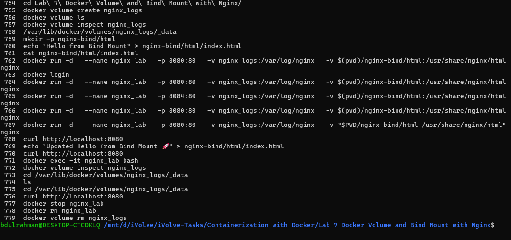
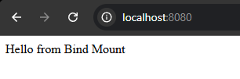
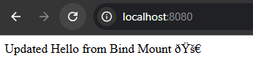

# Lab 7: Docker Volume and Bind Mount with Nginx

## Objective

Create a Docker volume to persist Nginx logs, use a bind mount to serve a custom HTML file, and verify data persistence and live updates.

---

## Prerequisites

* Ubuntu / Debian-based Linux system
* Docker installed
* Internet connection

---

## Steps

### 1. Create Docker Volume

```bash
docker volume create nginx_logs
```

Verify the volume:

```bash
docker volume ls
```

---

### 2. Create Bind Mount Directory

```bash
mkdir -p nginx-bind/html
```

---

### 3. Create index.html File

```bash
echo "Hello from Bind Mount" > nginx-bind/html/index.html
```

---

### 4. Run Nginx Container

```bash
docker run -d \
  --name nginx_lab \
  -p 8080:80 \
  -v nginx_logs:/var/log/nginx \
  -v $(pwd)/nginx-bind/html:/usr/share/nginx/html \
  nginx
```

---

### 5. Verify Nginx Page

```bash
curl http://localhost:8080
```

Expected output:

```
Hello from Bind Mount
```

---

### 6. Modify HTML File and Verify Again

```bash
echo "Updated Hello from Bind Mount" > nginx-bind/html/index.html
```

```bash
curl http://localhost:8080
```

Expected output:

```
Updated Hello from Bind Mount
```

---

### 7. Verify Logs Inside Container

```bash
docker exec -it nginx_lab bash
cd /var/log/nginx
ls
```

---

### 8. Verify Logs in Volume

```bash
docker volume inspect nginx_logs
```

Navigate to:

```
/var/lib/docker/volumes/nginx_logs/_data
```

---

### 9. Delete the Volume

```bash
docker stop nginx_lab
docker rm nginx_lab
docker volume rm nginx_logs
```

---

## Screenshots

### Commands



### Before



### After



---

## Summary

| Step                  | Command / Action                              | Result                          |
| --------------------- | --------------------------------------------- | ------------------------------- |
| Create volume         | `docker volume create nginx_logs`             | Volume created successfully     |
| Create directory      | `mkdir -p nginx-bind/html`                    | Directory created               |
| Create HTML           | `echo "Hello..." > index.html`                | File created                    |
| Run container         | `docker run ...`                              | Nginx container running         |
| Verify page           | `curl localhost:8080`                         | HTML displayed                  |
| Modify file           | Update index.html                             | Changes reflected instantly     |
| Check logs            | `docker exec` / inspect volume                | Logs available                  |
| Cleanup               | `docker rm` + `docker volume rm`              | Resources removed               |

---

## Notes

* Docker volumes persist data independently of containers
* Bind mounts reflect changes instantly from host to container
* Nginx serves files directly from the bind-mounted directory
