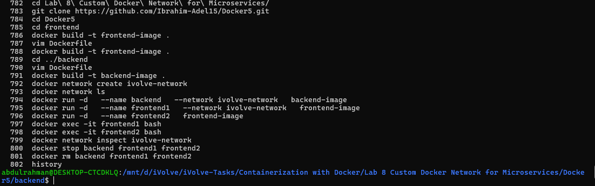

# Lab 8: Custom Docker Network for Microservices

## Objective

Clone frontend and backend microservices, containerize them using Docker, create a custom network, and verify communication between containers using both custom and default Docker networks.

---

## Prerequisites

* Ubuntu / Debian-based Linux system
* Docker installed
* Internet connection

---

## Steps

### 1. Clone the Source Code

```bash id="a2k9xq"
git clone https://github.com/Ibrahim-Adel15/Docker5.git
cd Docker5
```

---

### 2. Write Dockerfile for Frontend

```Dockerfile id="f1r9ab"
FROM python:3.10

WORKDIR /app

COPY . .

RUN pip install -r requirements.txt

EXPOSE 5000

CMD ["python", "app.py"]
```

Build frontend image:

```bash id="c7m2ld"
docker build -t frontend-image .
```

---

### 3. Write Dockerfile for Backend

```Dockerfile id="b8x3qp"
FROM python:3.10

WORKDIR /app

COPY . .

RUN pip install flask

EXPOSE 5000

CMD ["python", "app.py"]
```

Build backend image:

```bash id="z9t4we"
docker build -t backend-image .
```

---

### 4. Create Custom Docker Network

```bash id="n3v8kc"
docker network create ivolve-network
```

---

### 5. Run Backend Container on Custom Network

```bash id="q6p1rt"
docker run -d --name backend \
--network ivolve-network \
-p 5000:5000 backend-image
```

---

### 6. Run Frontend Container 1 (Custom Network)

```bash id="h2y7mn"
docker run -d --name frontend1 \
--network ivolve-network \
-p 5001:5000 frontend-image
```

---

### 7. Run Frontend Container 2 (Default Network)

```bash id="k5s9ld"
docker run -d --name frontend2 \
-p 5002:5000 frontend-image
```

---

### 8. Verify Communication

* frontend1 can communicate with backend using service/container name via `ivolve-network`
* frontend2 **cannot directly communicate** with backend due to different network

Test using browser:

```bash id="v8c1pq"
http://localhost:5000   # backend
http://localhost:5001   # frontend1 (connected network)
http://localhost:5002   # frontend2 (default network)
```

---

## Screenshots

### Commands Used



### Frontend 1 (Connected Network)


### Frontend 2 (Default Network)


---

## Summary

| Step           | Command                    | Result                       |
| -------------- | -------------------------- | ---------------------------- |
| Clone repo     | `git clone`                | Source code downloaded       |
| Build frontend | `docker build`             | Frontend image created       |
| Build backend  | `docker build`             | Backend image created        |
| Create network | `docker network create`    | Custom network created       |
| Run backend    | `--network ivolve-network` | Connected container          |
| Run frontend1  | custom network             | Can communicate with backend |
| Run frontend2  | default network            | No backend communication     |
| Delete network | `docker network rm`        | Network removed              |

---

## Notes

* Containers inside the same custom network can communicate using container names.
* Default network isolates frontend2 from backend communication.
* Docker networks are essential for microservices architecture.
* Always ensure ports are correctly mapped for external access.
