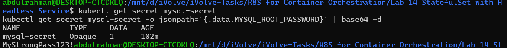
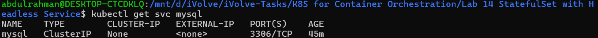
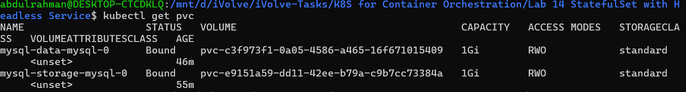
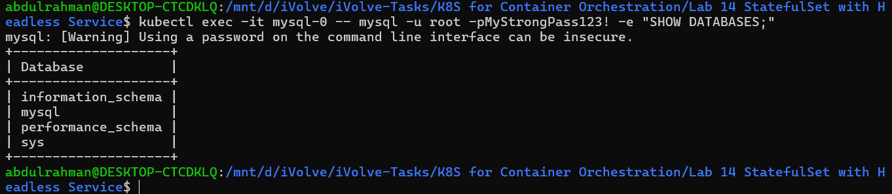
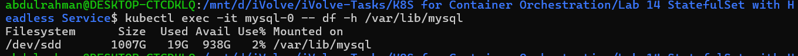

# Lab 14: StatefulSet with Headless Service
## Objective
Create and manage a MySQL StatefulSet with persistent storage, secret-based configuration, node tolerations, and a headless service for stable DNS-based pod discovery in Kubernetes.

---

## Prerequisites
* Ubuntu / Debian-based Linux system
* Kubernetes cluster (Kind / Minikube)
* kubectl installed and configured
* Existing namespace (default or custom)
* Internet connection

---

## Steps

### 1. Create the Secret
```yaml
apiVersion: v1
kind: Secret
metadata:
  name: mysql-secret
type: Opaque
stringData:
  MYSQL_ROOT_PASSWORD: "MyStrongPass123!"
```
Apply Secret:
```bash
kubectl apply -f secret.yaml
```

---

### 2. Create the Headless Service
```yaml
apiVersion: v1
kind: Service
metadata:
  name: mysql
spec:
  clusterIP: None
  selector:
    app: mysql
  ports:
    - port: 3306
      targetPort: 3306
```
Apply Service:
```bash
kubectl apply -f headless-service.yaml
```

---

### 3. Create the StatefulSet
```yaml
apiVersion: apps/v1
kind: StatefulSet
metadata:
  name: mysql
spec:
  serviceName: "mysql"
  replicas: 1
  selector:
    matchLabels:
      app: mysql
  template:
    metadata:
      labels:
        app: mysql
    spec:
      tolerations:
        - key: "node"
          operator: "Equal"
          value: "worker"
          effect: "NoSchedule"
      containers:
        - name: mysql
          image: mysql:8.0
          ports:
            - containerPort: 3306
          env:
            - name: MYSQL_ROOT_PASSWORD
              valueFrom:
                secretKeyRef:
                  name: mysql-secret
                  key: MYSQL_ROOT_PASSWORD
          volumeMounts:
            - name: mysql-data
              mountPath: /var/lib/mysql
  volumeClaimTemplates:
    - metadata:
        name: mysql-data
      spec:
        accessModes: ["ReadWriteOnce"]
        resources:
          requests:
            storage: 1Gi
```
Apply StatefulSet:
```bash
kubectl apply -f statefulset.yaml
```

---

### 4. Check StatefulSet Status
```bash
kubectl get statefulset mysql
```

---

### 5. Check Pod Status
```bash
kubectl get pods -w
```

---

### 6. Check PVC Status
```bash
kubectl get pvc
```

---

### 7. Verify Secret
```bash
kubectl get secret mysql-secret
kubectl get secret mysql-secret -o jsonpath='{.data.MYSQL_ROOT_PASSWORD}' | base64 -d
```

---

### 8. Verify Headless Service
```bash
kubectl get svc mysql
# CLUSTER-IP should show "None"
```

---

### 9. Verify Toleration on Pod
```bash
kubectl describe pod mysql-0 | grep -A5 Tolerations
```

---

### 10. Connect to MySQL and Confirm Database is Operational
```bash
kubectl exec -it mysql-0 -- mysql -u root -pMyStrongPass123! -e "SHOW DATABASES;"
```

---

### 11. Verify Headless DNS Resolution
```bash
kubectl run dns-test --image=busybox --rm -it --restart=Never -- \
  nslookup mysql-0.mysql
```

---

### 12. Verify Volume Mount Inside Pod
```bash
kubectl exec -it mysql-0 -- df -h /var/lib/mysql
```

---

## Screenshots

### Commands Used


---

### StatefulSet & Pod Status


---

### Headless Service (clusterIP: None)


---

### PVC Bound Status


---

### MySQL Operational (SHOW DATABASES)


---

### DNS Resolution via Headless Service


---

## Summary
| Step               | Command / Action        | Result                              |
| ------------------ | ----------------------- | ----------------------------------- |
| Create Secret      | YAML + `kubectl apply`  | Root password stored securely       |
| Create Service     | YAML + `kubectl apply`  | Headless service created (None IP)  |
| Create StatefulSet | YAML + `kubectl apply`  | MySQL pod created with stable name  |
| Check StatefulSet  | `kubectl get sts`       | READY 1/1                           |
| Check PVC          | `kubectl get pvc`       | PVC auto-created and Bound          |
| Verify Secret      | `kubectl get secret`    | Secret exists, password encoded     |
| Verify Toleration  | `kubectl describe pod`  | node=worker:NoSchedule tolerated    |
| Connect to MySQL   | `kubectl exec`          | SHOW DATABASES returns results      |
| DNS resolution     | `nslookup mysql-0.mysql`| Resolves to pod IP                  |
| Volume mount       | `df -h /var/lib/mysql`  | Persistent volume mounted           |

---

## Notes
* The StatefulSet gives each pod a stable, predictable name (`mysql-0`, `mysql-1`, ...).
* `serviceName` in the StatefulSet must match the headless Service name exactly.
* `volumeClaimTemplates` automatically creates a PVC per pod — no manual PVC creation needed.
* The headless service enables DNS entries in the format `<pod-name>.<service-name>` (e.g. `mysql-0.mysql`).
* Tolerations must exactly match the node taint key, value, and effect or the pod will stay `Pending`.
* Always verify **Bound** PVC status and **1/1 Ready** pod status before connecting.
