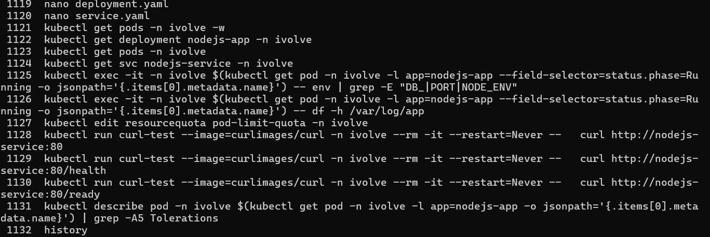
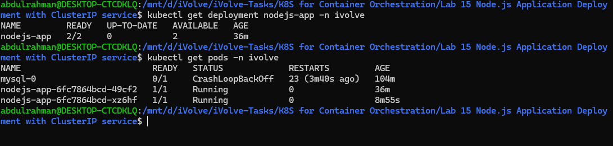
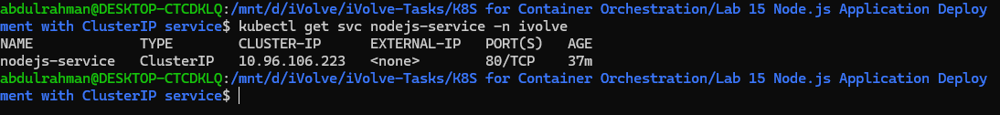
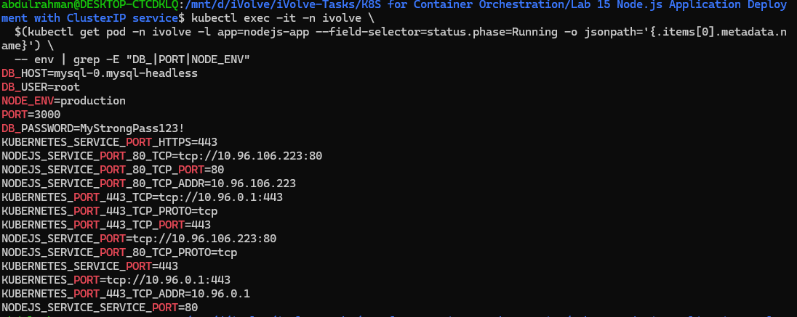
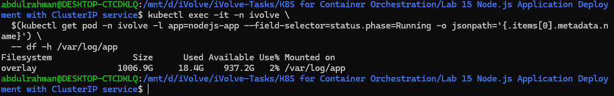

# Lab 15: Node.js Application Deployment with ClusterIP Service
## Objective
Deploy a Node.js application using a Kubernetes Deployment with 2 replicas, environment variables from a ConfigMap and Secret, a toleration for tainted nodes, persistent storage from an existing PV, and a ClusterIP service to balance traffic across all replicas.

---

## Prerequisites
* Ubuntu / Debian-based Linux system
* Kubernetes cluster (Kind / Minikube)
* kubectl installed and configured
* Existing namespace `ivolve`
* Docker Hub image: `abdulrahman1235/node_app:latest`
* PVC `app-logs-pvc` already created (from Lab 13)
* Internet connection

---

## Steps

### 1. Set Default Namespace Context
```bash
kubectl config set-context --current --namespace=ivolve
```

---

### 2. Create ConfigMap
```bash
kubectl create configmap nodejs-config \
  --from-literal=DB_HOST=mysql-0.mysql-headless \
  --from-literal=DB_USER=root \
  --from-literal=NODE_ENV=production \
  --from-literal=PORT=3000 \
  -n ivolve
```

---

### 3. Create Secret
```bash
kubectl create secret generic nodejs-secret \
  --from-literal=DB_PASSWORD=MyStrongPass123! \
  -n ivolve
```

---

### 4. Verify ConfigMap and Secret
```bash
kubectl get configmap nodejs-config -n ivolve
kubectl get secret nodejs-secret -n ivolve
```

---

### 5. Create Deployment
```yaml
apiVersion: apps/v1
kind: Deployment
metadata:
  name: nodejs-app
  namespace: ivolve
spec:
  replicas: 2
  selector:
    matchLabels:
      app: nodejs-app
  template:
    metadata:
      labels:
        app: nodejs-app
    spec:
      tolerations:
        - key: "node"
          operator: "Equal"
          value: "worker"
          effect: "NoSchedule"
      containers:
        - name: nodejs-app
          image: abdulrahman1235/node_app:latest
          ports:
            - containerPort: 3000
          envFrom:
            - configMapRef:
                name: nodejs-config
            - secretRef:
                name: nodejs-secret
          volumeMounts:
            - name: app-logs
              mountPath: /var/log/app
      volumes:
        - name: app-logs
          persistentVolumeClaim:
            claimName: app-logs-pvc
```
Apply Deployment:
```bash
kubectl apply -f deployment.yaml
```

---

### 6. Create ClusterIP Service
```yaml
apiVersion: v1
kind: Service
metadata:
  name: nodejs-service
  namespace: ivolve
spec:
  type: ClusterIP
  selector:
    app: nodejs-app
  ports:
    - port: 80
      targetPort: 3000
```
Apply Service:
```bash
kubectl apply -f service.yaml
```

---

### 7. Check Deployment Status
```bash
kubectl get deployment nodejs-app -n ivolve
# READY shows 1/2 — 1 pod pending due to ReadWriteOnce PV (expected)
```

---

### 8. Check Pod Status
```bash
kubectl get pods -n ivolve -w
# 1 pod Running, 1 pod Pending — this is correct and expected
```

---

### 9. Check Service Status
```bash
kubectl get svc nodejs-service -n ivolve
# Should show TYPE=ClusterIP and PORT=80/TCP
```

---

### 10. Verify Toleration on Pod
```bash
kubectl describe pod -n ivolve -l app=nodejs-app | grep -A5 Tolerations
# Should show: node=worker:NoSchedule
```

---

### 11. Verify Environment Variables Injected
```bash
kubectl exec -it -n ivolve \
  $(kubectl get pod -n ivolve -l app=nodejs-app --field-selector=status.phase=Running -o jsonpath='{.items[0].metadata.name}') \
  -- env | grep -E "DB_|PORT|NODE_ENV"
```

---

### 12. Verify Volume Mount
```bash
kubectl exec -it -n ivolve \
  $(kubectl get pod -n ivolve -l app=nodejs-app --field-selector=status.phase=Running -o jsonpath='{.items[0].metadata.name}') \
  -- df -h /var/log/app
```

---

### 13. Fix Pod Quota (if needed)
If you see:
> exceeded quota: pod-limit-quota
Run:
```bash
kubectl edit resourcequota pod-limit-quota -n ivolve
# Change pods: "2" to pods: "3" under spec.hard
```

---

### 14. Test App via ClusterIP Service
```bash
kubectl run curl-test --image=curlimages/curl -n ivolve --rm -it --restart=Never -- \
  curl http://nodejs-service:80
```

---

### 15. Verify /health and /ready Endpoints
```bash
kubectl run curl-test --image=curlimages/curl -n ivolve --rm -it --restart=Never -- \
  curl http://nodejs-service:80/health

kubectl run curl-test --image=curlimages/curl -n ivolve --rm -it --restart=Never -- \
  curl http://nodejs-service:80/ready
```

---

## Screenshots

### Commands Used


---

### Deployment & Pod Status


---

### ClusterIP Service


---

### Environment Variables Injected


---

### Volume Mount



## Summary
| Step                  | Command / Action              | Result                               |
| --------------------- | ----------------------------- | ------------------------------------ |
| Set namespace         | `kubectl config set-context`  | Default namespace set to ivolve      |
| Create ConfigMap      | `kubectl create configmap`    | Non-sensitive config stored          |
| Create Secret         | `kubectl create secret`       | Sensitive credentials stored         |
| Create Deployment     | YAML + `kubectl apply`        | nodejs-app deployed, 2 replicas      |
| Create Service        | YAML + `kubectl apply`        | ClusterIP service on port 80         |
| Check Deployment      | `kubectl get deployment`      | 1/2 ready (1 pending is expected)    |
| Check Pods            | `kubectl get pods`            | 1 Running, 1 Pending                 |
| Verify Toleration     | `kubectl describe pod`        | node=worker:NoSchedule tolerated     |
| Verify env vars       | `kubectl exec -- env`         | DB_HOST, DB_USER, DB_PASSWORD shown  |
| Verify volume         | `kubectl exec -- df -h`       | /var/log/app mounted                 |
| Test app              | `curl nodejs-service:80`      | HTTP response from Node.js app       |
| Test /health          | `curl .../health`             | Status OK response                   |
| Test /ready           | `curl .../ready`              | Status OK response                   |

---

## Notes
* The Deployment is set to 2 replicas but only 1 pod will run — the PV from Lab 13 uses `ReadWriteOnce`, which allows only one node to mount it at a time. This is expected behavior as stated in the lab.
* `envFrom` with `configMapRef` and `secretRef` injects all keys from the ConfigMap and Secret as environment variables automatically.
* The ConfigMap and Secret must exist in the **same namespace** as the Deployment (`ivolve`) — cross-namespace references are not supported.
* `DB_HOST=mysql-0.mysql-headless` uses the headless service DNS from Lab 14 to connect to MySQL.
* The ClusterIP service is only accessible from within the cluster — use `kubectl exec` or a temporary pod to test it.
* Always verify pod status is `1/1 Running` before testing the service endpoint.
